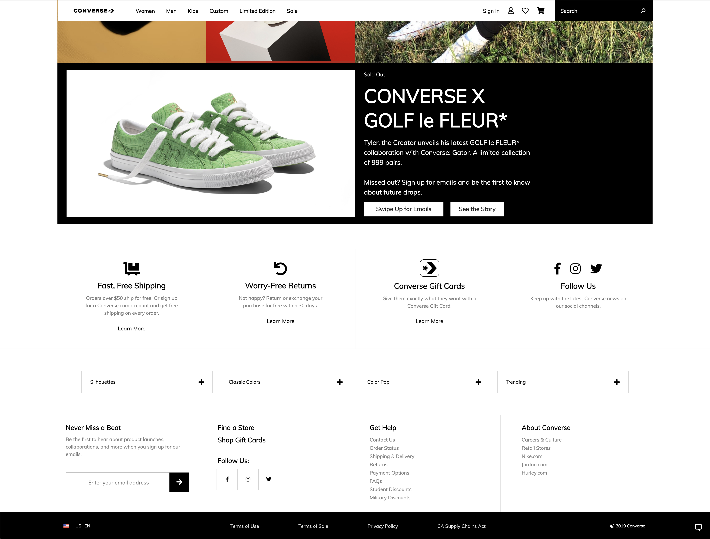
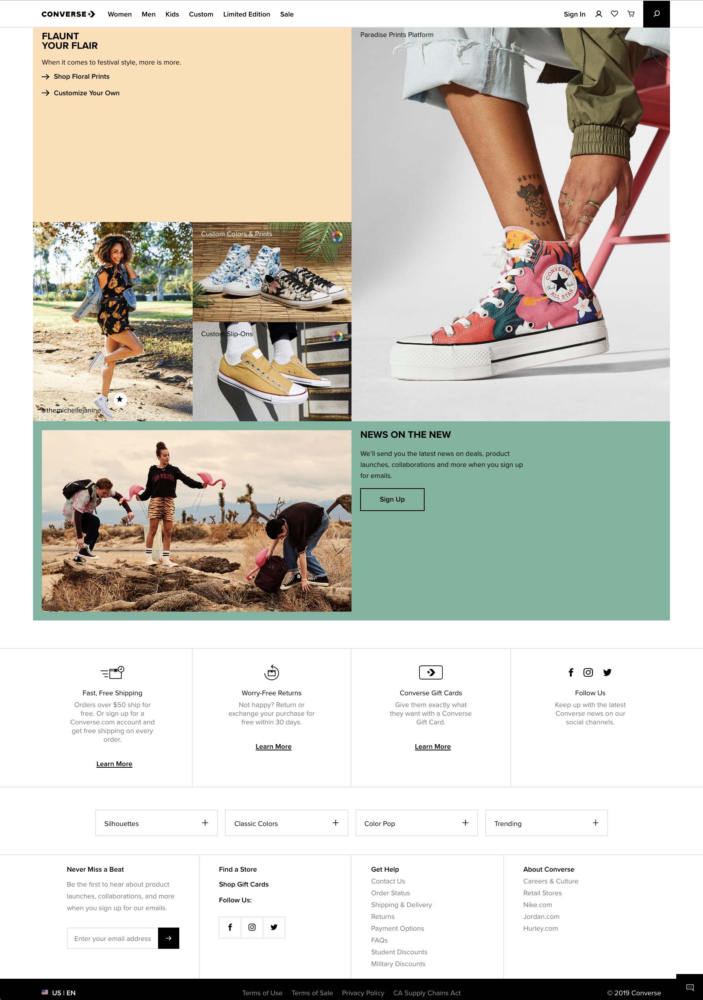
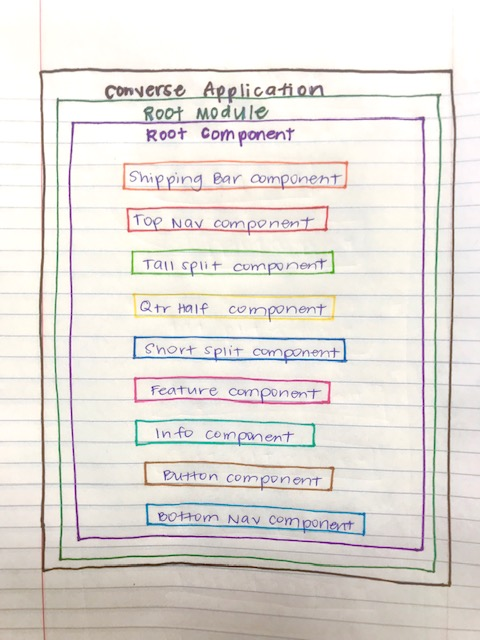

# Converse - Site Rebuild

#### _Front End Development/JavaScript, Week 12 and 13 - Independent Project, 3.29.19-4.4.19_

#### By _**Randee Layosa**_


[](https://opensource.org/licenses/MIT)

## Description

_This application is a clone of the [Converse.com](https://www.converse.com) landing page. It uses Angular to build the site's different components and Firebase as a database._

## Preview
<p align="center">My Rebuild</p>
<p align="center">



</p>

<p align="center">Original Site</p>
<p align="center">
  
  
  
</p>

## Technologies Used

  * _This project was generated with [Angular CLI](https://github.com/angular/angular-cli) version 1.6.5._
  * _Typescript_
  * _Webpack_
  * _Sass_

## Setup/Installation Requirements

#### To open and view this project file:
1. Clone this GitHub repository https://github.com/randeelayosa/galactic-calculator.git to your Desktop.
* Install git onto your computer if it isn't already.
* To clone the project down to your desktop, open your Terminal, and enter the following commands:
  ```
  cd desktop
  git clone [paste link here]
  cd desktop/[project folder name]
  atom .
  ```
 * _You can use another text editor if Atom is not your preferred program._

#### Running the server to view the live project
* Run `ng serve` in the project directory in Terminal. Go to `http://localhost:4200/` in the browser of your choice. _Note: The app will automatically reload if you change any of the source files._

#### Running unit tests
* Run `ng test` to execute the unit tests via [Karma](https://karma-runner.github.io).

#### Running end-to-end tests
* Run `ng e2e` to execute the end-to-end tests via [Protractor](http://www.protractortest.org/).

#### Further help
* To get more help on the Angular CLI use `ng help` or go check out the [Angular CLI README](https://github.com/angular/angular-cli/blob/master/README.md).


## Planning

**Configuration/Dependencies**

  | Configuration/Dependencies | Use |
| :-------------     | :------------- |
| Angular | framework |
| Clean-Webpack-Plugin | clears project dist folder |
| CSS-Loader, Style-Loader, Sass-Loader, Node-Sass | styling |
| ESLint | JavaScript linter, checks code for errors |
| File-Loader | image loader |
| HTML-Webpack-Plugin | loads HTML file |
| Jasmine, Karma | for testing code |
| Typescript | programming language |
| UglifyJS-Webpack-Plugin | minifies code |
| Webpack | bundles/compiles code |

**Component Layout**

<p align="center">
  
</p>

**Features Built and To Be Completed**
- [x] Navigation bar
- [x] Body component with image boxes
- [x] Footer navigation bar
- [ ] Dropdown sub-menu for each tab in the navigation bar
- [ ] A market page of one of the shoe styles that has a router attached
- [ ] Shopping cart feature that stores user's desired purchase
- [ ] Authentication/Sign in feature to allow user's to make their purchase
- [x] Sass styling
- [ ] Program has a Firebase database established
- [ ] Program is deployed

**Integration**
  * src folder: files responsible for UI code and backend functionality
  * Display: clone of the Converse landing page
  * Integrate Firebase to add Sign In and Shopping Cart functionality

**UX/UI**
  * Include and modify Sass
  * Incorporate photos, gifs, videos and icons the real Converse site uses

**Polish**
  * Delete unused dependencies in `package.json` and plugins in the config files
  * Ensure README includes all necessary language for instructions, bugs, and documentation

### Legal

*This software is licensed under MIT license.*

Copyright (c) 2019 **_Randee Layosa_**
